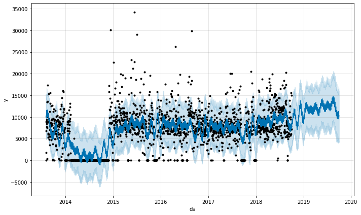
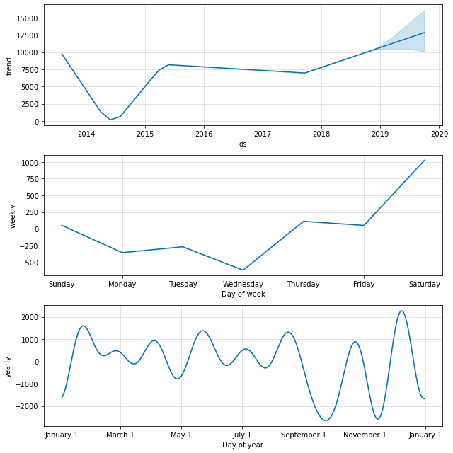
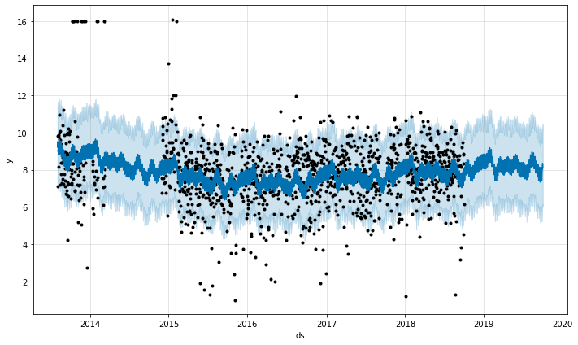
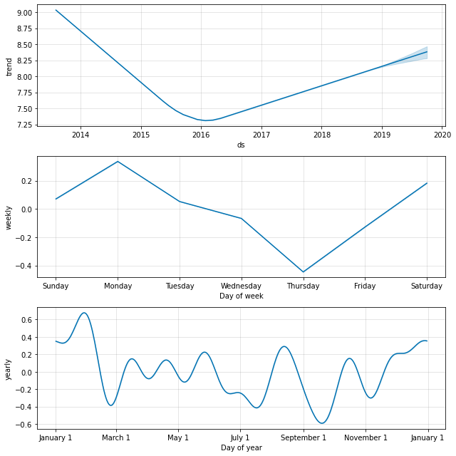

# Understanding activity and sleep patterns over time using time series analysis

## Introduction

In this project I will be looking at data on activity and sleep to better understand how that varies over different periods, but also to try and focast how that may change in the future.

This study is quite unique among all my projects, in that the source of the data is me: my own activity and sleep! My general interest here is that I worry perhaps that my sleep has been getting worse over time, and also I am not sure if I am becoming less active. I would like to improve and increase both my activity levels and the amount of sleep I get. So I would like to better understand if these have really been getting worse over time, what exactly has been happening, and what is likely to happen in future.

So the specific questions I have for this study for both activity and sleep are:

- How have these been changing over time generally?
- What are the best and worst days of the week for these?
- Based on previous data, what is forcast for the future for these? and with how much confidence?

I use [Facebook Prophet](https://facebook.github.io/prophet/) to do the analysis and modelling of the data.

## Key files

- [Jupyter notebook of time series analysis and modelling](https://github.com/pranath/activity_and_sleep/blob/master/steps_and_sleep_time_series.ipynb)

## Results

### Steps

I found that the model performed very poorly on validation of its forcasts (i.e. a rmse of 3000+). With that caveat, there were some hints of the following:

- That my steps have been decreasingly slightly from 2013-2017 and then increasing from 2018 onwards
- Saturdays seem to be my best day and Wednesday is my worst day for steps
- I seem more consistant with taking more steps in the summer months from March-September and more variable in the winter months from October-Feburary

**Steps: Existing data and overall forcast 1 year ahead**

**Steps: Forcast components for overall trend, weekly & monthly seasonality**

### Sleep

I found the model acheived a MAPE error in it's forcasts of between 17-22% for periods of around a month to a year respectively on validation. There were also indications of the following:

- That my sleep had been getting worse from 2013-2016, then improving from 2016-2018 onwards
- Mondays seem to be my best day for sleep, and Thursdays my worst day
- I seem to get more consistant and better sleep in the summer months from March-September and more variable sleep in the winter months from October-Feburary

**Sleep: Existing data and overall forcast 1 year ahead**

**Sleep: Forcast components for overall trend, weekly & monthly seasonality**

The Prophet library itself was very easy and quick to use with its default setup, especially in terms of building a model, evaluating the model, and displaying the results of both of these key processes in a way that was easy and intuitive to understand. The configuration options are something that could be explored much more to enable fine tuning of the model and to customise it to a specific use-case.
